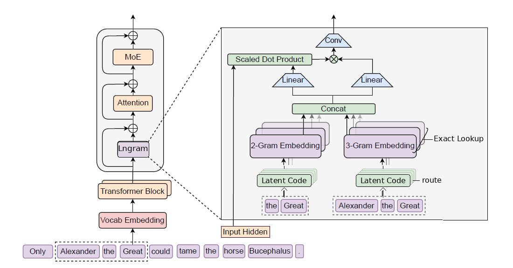

## Abstract

Lngram upgrades Engram from modeling on **tokenizer IDs** to modeling on **hidden-state IDs**.  
With this design, Lngram achieves stronger performance while naturally supporting deployment on models beyond the language domain, including models in other modalities.

The paper is available at https://github.com/zyaaa-ux/Lngram/blob/main/paper.pdf.

## Introduction

Transformer architectures have driven the development of multimodal models and have become the backbone of today’s large-scale models.
A key reason for their success is that the unified attention--feedforward stack can handle both local patterns and global dependencies within a single framework.
From the perspective of computational function, however, standard Transformers still represent operations of fundamentally different natures using the same dense neural computation.
Specifically, sequence modeling typically involves two kinds of subtasks: one is compositional reasoning, which requires deeper dynamic computation that changes with context; the other is knowledge retrieval, which depends primarily on matching local static patterns and is better implemented through low-cost lookup operations.
Because standard Transformers lack a native lookup primitive, such retrieval can only be approximated through multiple layers of attention and feedforward networks.
For example, to recognize a common multi-token entity, the model often has to gradually aggregate local context and complete the match in the early layers.
Functionally, this process is closer to table lookup than to deep reasoning, and therefore consumes effective depth that could otherwise be used for subsequent compositional computation, ultimately affecting the model’s reasoning performance.

To separate this type of static retrieval from backbone computation, DeepSeek explored an alternative called Engram.
Engram performs local suffix N-gram retrieval at designated layers: it first compresses tokenizer outputs into normalized identifiers, then maps them through deterministic multi-head hashing to several embedding tables, retrieves static vectors, and fuses them with the current hidden states through context-dependent gating and lightweight convolutions.
However, our investigation suggests that in such methods the retrieval keys are still constructed entirely from tokenizer IDs, so the matching boundaries remain constrained by the tokenizer’s segmentation scheme.
Meanwhile, because the combinatorial space of N-grams grows rapidly with vocabulary size and order, practical implementations can only rely on hash-based compression to map a large number of patterns to a limited number of table entries, making collisions unavoidable.
Moreover, the hash functions themselves are not learnable, making it difficult to adaptively correct matching errors according to the data and task.
More importantly, models in non-text modalities often do not have a stable text tokenizer at all; vision and multimodal models typically rely on image patches, visual encoder features, or cross-modal connector modules rather than fixed text subword IDs.
These limitations make such approaches better suited to experimental exploration than to direct use in real systems.

Therefore, if conditional memory is to be extended to more general representation spaces, the key is to learn discrete keys from hidden states rather than directly reusing tokenizer IDs.
A GitHub demo of ROSA inspired us: by mapping hidden states to binary or low-bit routing codes through learnable projections and using them to construct keys for local conditional matching, it is possible to preserve a large portion of the information in the original hidden states.
Motivated by this idea, we replaced the original vectors in the key-value (KV) cache used for attention computation with binarized discrete representations in Qwen3.
Experimental results show that, under windowed attention alone, the model’s performance on simple long-context tasks already approaches that of a global-attention baseline.
Building on this observation, we adapt the discrete-hidden-state approach to the classical n-gram matching framework, and combine it with modern refinements to propose Lngram (Latent n-gram), a latent-space conditional matching mechanism.

Specifically, Lngram first discretizes the input hidden states into routing codes and constructs n-gram indices along the temporal dimension; it then performs exact table lookup based on these indices to retrieve the corresponding memory representations.
The retrieved results are modulated by a contextual gating mechanism and added back to the original hidden states as a residual, after which they are fed into the original attention module.
To address the non-differentiability introduced by hard discrete routing, we further design optional approximate and exact gradient backpropagation methods to ensure stable training.

We first evaluate Lngram on natural language processing (NLP) tasks.
Under the same parameter count and training conditions, models equipped with Lngram outperform the baseline on all evaluation items.
Subsequent experiments on vision-language models (VLMs) and vision-language-action models (VLAs) show that this gain is not limited to the text modality.
LogitLens and CKA analyses show that Lngram reduces the need for the backbone to reconstruct static knowledge in the early layers, thereby increasing the effective depth available for compositional computation;
at the same time, some local dependencies are handled by lookup operations, allowing the attention module to devote more capacity to global context modeling, which correspondingly improves performance in long-context scenarios.
We also integrate Lngram as an additional component into pretrained models and train only the Lngram component on domain-specific data.
The results show that this approach can effectively inject domain-specific knowledge, with performance close to that of full fine-tuning; when Lngram is jointly trained with the base model parameters, its performance is substantially better than that of full fine-tuning alone.

Finally, we evaluate the runtime and memory overhead of Lngram during the prefilling stage (prefill) and the autoregressive decoding stage (decode).
Lngram’s online computation involves only a small number of linear layers and the table entries that are actually hit, and the table parameters can also be deployed separately from GPU memory in host memory.
Therefore, even when the tables are large, the additional impact on throughput and memory usage remains small.
Overall, Lngram shows that rewriting a class of local static matching operations originally performed by dense computation as conditional lookup can improve a model’s effective depth at low system cost, thereby enhancing reasoning performance.
At the same time, this idea also provides a scalable retrieval primitive for multimodal models.
